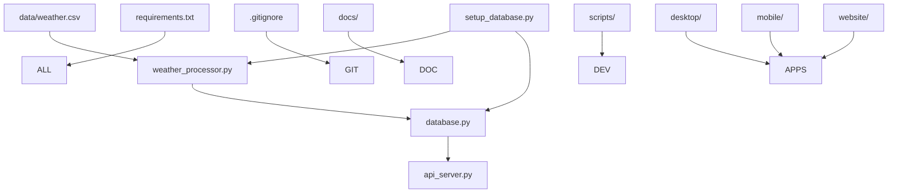

# WeatherWise Project File Structure

## 📁 **Complete Directory Structure**

```
weather_predictor/
├── 📁 .git/                       # Git version control metadata
├── 📄 .gitignore                  # Git ignore rules (7.0 KB)
├── 📄 requirements.txt            # Python dependencies (178 bytes)
├── 📄 setup_database.py           # Database initialization script (3.7 KB)
│
├── 🧠 **CORE BACKEND FILES**
├── 📄 api_server.py               # FastAPI backend server (13.8 KB)
├── 📄 database.py                 # Database management & model storage (16.6 KB)
├── 📄 weather_processor.py        # ML pipeline & model training (14.0 KB)
│
├── 📊 **DATA & MODELS**
├── � data/                       # Data files directory
│   └── �📄 weather.csv             # Historical weather data (1.3 MB)
├── 📄 weatherwise.db              # SQLite database (9.8 MB) [LOCAL ONLY]
├── 📄 weather_predictions.ipynb   # Original Jupyter analysis (64.4 KB)
│
├── 📚 **DOCUMENTATION**
├── 📁 docs/                       # Project documentation
│   ├── 📄 README.md               # Project documentation (7.3 KB)
│   └── 📄 FILE_STRUCTURE.md       # This file structure guide
│
├── 🛠️ **UTILITY SCRIPTS**
├── 📁 scripts/                    # Development & deployment scripts
│   └── 📄 README.md               # Scripts overview
│
├── 🖥️ **DESKTOP APP**
├── 📁 desktop/                    # Tauri desktop application
│   └── 📄 README.md               # Desktop app plans
│
├── 📱 **MOBILE APP**
├── 📁 mobile/                     # React Native mobile app
│   └── 📄 README.md               # Mobile app plans
│
├── 🌐 **WEBSITE**
├── 📁 website/                    # Marketing landing page
│   └── 📄 README.md               # Website plans
│
└── 📁 __pycache__/                # Python bytecode cache [IGNORED]
    ├── api_server.cpython-312.pyc
    ├── database.cpython-312.pyc
    └── weather_processor.cpython-312.pyc
```

## 🎯 **File Categories & Purposes**

### 🔧 **Configuration & Setup**
| File | Size | Purpose |
|------|------|---------|
| `.gitignore` | 7.0 KB | Excludes sensitive files, cache, and databases from Git |
| `requirements.txt` | 178 bytes | Python package dependencies |
| `setup_database.py` | 3.7 KB | Automated database setup for new installations |

### 🧠 **Core Backend System**
| File | Size | Purpose |
|------|------|---------|
| `api_server.py` | 13.8 KB | FastAPI REST server with endpoints for weather predictions |
| `database.py` | 16.6 KB | SQLite database management, model storage, caching |
| `weather_processor.py` | 14.0 KB | ML pipeline, feature engineering, model training |

### 📊 **Data & Models**
| File/Directory | Size | Purpose |
|----------------|------|---------|
| `data/weather.csv` | 1.3 MB | Historical weather data (25,500+ records, 1951-present) |
| `weatherwise.db` | 9.8 MB | SQLite database with ML models, cache, analytics |
| `weather_predictions.ipynb` | 64.4 KB | Original Jupyter notebook analysis |

### 📚 **Documentation**
| Directory/File | Purpose |
|-----------------|---------|
| `docs/` | Project documentation directory |
| `docs/README.md` | Complete project documentation |
| `docs/FILE_STRUCTURE.md` | This file structure guide |

### 🛠️ **Development Tools**
| Directory | Purpose |
|-----------|---------|
| `scripts/` | Utility scripts for development and deployment |
| `desktop/` | Tauri desktop application (planned) |
| `mobile/` | React Native mobile app (planned) |
| `website/` | Marketing landing page (planned) |

### 🗂️ **System Generated**
| Directory/File | Purpose |
|-----------------|---------|
| `.git/` | Git version control metadata |
| `__pycache__/` | Python bytecode cache (ignored in Git) |

## 🚀 **Architecture Overview**

### **Data Flow**
```
data/weather.csv → weather_processor.py → weatherwise.db → api_server.py → REST API
```

### **Dependencies**
```
setup_database.py → database.py → weather_processor.py → api_server.py
```

## 📋 **File Ownership & Responsibilities**

### **🔴 Critical Files (Core Functionality)**
- `api_server.py` - Main application entry point
- `database.py` - Data persistence layer
- `weather_processor.py` - ML intelligence
- `data/weather.csv` - Training data source

### **🟡 Important Files (Setup & Config)**
- `setup_database.py` - New user onboarding
- `requirements.txt` - Environment setup
- `docs/README.md` - Project documentation
- `.gitignore` - Security & cleanliness

### **🟢 Reference Files (Optional)**
- `weather_predictions.ipynb` - Research reference
- `weatherwise.db` - Generated locally (not in Git)
- `docs/FILE_STRUCTURE.md` - Project organization guide

## 🛡️ **Security & Git Management**

### **✅ Included in Git**
- All Python source code
- Configuration files
- Documentation
- Training data (`data/weather.csv`)
- Git configuration
- Directory structure and README files

### **🚫 Excluded from Git (.gitignore)**
- `weatherwise.db` - Database files
- `__pycache__/` - Python cache
- `*.pyc` - Compiled Python
- `*.log` - Log files
- Environment variables

## 📏 **Size Analysis**

### **Total Project Size: ~12.8 MB**
- **Database**: 9.8 MB (76% - Local only)
- **Training Data**: 1.3 MB (10%)
- **Source Code**: 65.9 KB (0.5%)
- **Documentation**: 74.6 KB (0.6%)
- **Analysis Notebook**: 64.4 KB (0.5%)

### **Git Repository Size: ~1.5 MB**
- Excludes database, includes only source code and data

## 🎯 **File Interdependencies**



## 🔄 **Development Workflow**

### **New Developer Setup**
1. `git clone` → Get source code
2. `pip install -r requirements.txt` → Install dependencies
3. `python setup_database.py` → Create local database
4. `python api_server.py` → Start development server

### **Code Changes**
1. Edit source files (`api_server.py`, `weather_processor.py`, `database.py`)
2. Test with local database
3. Commit to Git (database excluded automatically)
4. Deploy with fresh database setup

## 📊 **Current Implementation Status**

### **Implemented Directories**
```
weather_predictor/
├── 🖥️ desktop/                   # Tauri desktop app (ready for development)
├── 📱 mobile/                     # React Native mobile app (ready for development)  
├── 🌐 website/                    # Marketing landing page (ready for development)
├── 🛠️ scripts/                   # Utility scripts (ready for development)
├── 📚 docs/                      # Project documentation (organized)
└── 📊 data/                      # Data files (organized)
```

---

**Current Status**: Organized project structure ready for multi-platform development with clean separation of concerns.